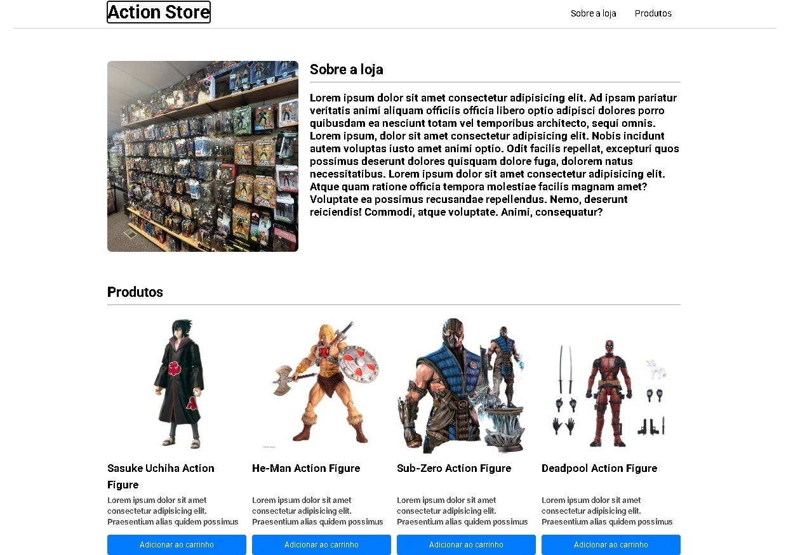

  

# 🛍️ Action Store

Uma interface de e-commerce estática e moderna, projetada com foco total em arquitetura CSS robusta e design responsivo multiplataforma. O projeto foi desenvolvido para consolidar o domínio prático em posicionamento de elementos e estruturas de layouts complexas na web.

> 🎓 **Projeto Acadêmico:** Desenvolvido como exercício prático do Módulo 11 da formação frontend na **EBAC (Escola Britânica de Artes Criativas e Tecnologia)**.

---

## 🚀 Tecnologias Utilizadas

O desenvolvimento priorizou a escrita de código nativo, limpo e performático:

* **HTML5** – Estruturação semântica para garantir acessibilidade e SEO aplicados a uma vitrine de produtos.
* **CSS3 Avançado** – Utilização profunda das propriedades modernas de estilização, incluindo **Flexbox** para componentes internos e de navegação, e **CSS Grid** para a distribuição simétrica da vitrine.

---

## ✨ Funcionalidades e Diferenciais

* **Layout Multi-Grid Responsivo:** Implementação rigorosa de consultas `@media screen` configuradas com breakpoints específicos para adaptar a experiência do usuário dinamicamente:
  * **Desktop (Telas grandes):** Vitrine organizada em **4 colunas** para máximo aproveitamento do espaço.
  * **Tablet (Telas médias):** Adaptação harmônica para **2 colunas**, mantendo a legibilidade das informações.
  * **Mobile (Telas pequenas):** Redimensionamento vertical para **1 coluna**, otimizando o toque e a navegação em smartphones.
* **Componentes de E-commerce:** Estruturação visual completa de cards de produtos (com imagens, títulos, descrições e botões de chamada para ação), barra de navegação responsiva e rodapé institucional.
* **Efeitos de Hover Fluidos:** Microinterações suaves nos elementos interativos (links e botões) para enriquecer o feedback visual.

---

🧠 Principais Aprendizados (EBAC)
Breakpoints Estratégicos: Compreensão prática de como e onde aplicar pontos de quebra CSS para que o layout mude de comportamento de forma suave entre diferentes dispositivos.

Flexbox vs. CSS Grid: Aprendizado sobre qual ferramenta escolher para cada cenário — utilizando Grid para a estrutura bidimensional da vitrine e Flexbox para o alinhamento unidimensional dos componentes internos.
